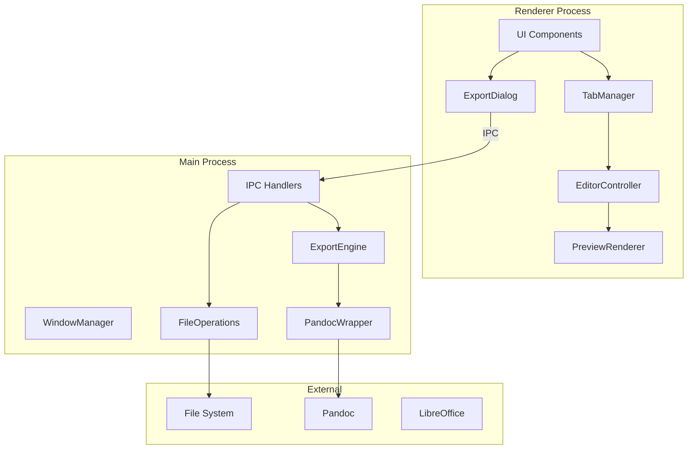

# PanConverter World-Class Improvement Plan

**Version**: 3.0 Roadmap
**Goal**: Transform PanConverter into a world-class, feature-rich, secure open source Markdown editor
**Current State**: v2.1.0 - Feature-rich but needs security hardening and architectural improvements

---

## Executive Summary

PanConverter has an impressive feature set (50+ features, 22 themes, PDF editor, batch processing). However, to become a world-class open source application, it needs:

1. **Critical**: Security hardening (Electron best practices)
2. **Critical**: Testing infrastructure
3. **High**: Code architecture refactoring
4. **High**: Developer experience improvements
5. **Medium**: Performance optimization
6. **Medium**: New killer features
7. **Lower**: Community & ecosystem building

---

## Phase 1: Security Hardening (Critical Priority)

### 1.1 Electron Security Configuration

**Current Issue**: `nodeIntegration: true` and `contextIsolation: false` in `src/main.js:203-204`

**Risk Level**: CRITICAL - Allows XSS to become full system compromise

**Implementation**:

```javascript
// Before (INSECURE)
webPreferences: {
  nodeIntegration: true,
  contextIsolation: false
}

// After (SECURE)
webPreferences: {
  nodeIntegration: false,
  contextIsolation: true,
  preload: path.join(__dirname, 'preload.js'),
  sandbox: true
}
```

**Tasks**:
- [ ] Create `src/preload.js` with secure IPC bridge
- [ ] Define explicit API surface in contextBridge
- [ ] Refactor all `require()` calls in renderer.js to use preload API
- [ ] Update all IPC communication to use new bridge
- [ ] Remove direct Node.js usage from renderer process
- [ ] Enable sandbox mode

**Files to Create**:
```
src/preload.js - Secure IPC bridge (~200 lines)
```

**Estimated Effort**: 2-3 days

---

### 1.2 Command Injection Prevention

**Current Issue**: `exec()` with template literals in `src/main.js:1493, 1542`

**Implementation**:

```javascript
// Before (VULNERABLE)
exec(`pandoc "${inputPath}" -o "${outputPath}"`, callback);

// After (SAFE)
const { execFile } = require('child_process');
execFile('pandoc', [inputPath, '-o', outputPath], callback);
```

**Tasks**:
- [ ] Replace all `exec()` calls with `execFile()`
- [ ] Implement argument array building instead of string concatenation
- [ ] Add path validation/sanitization helper function
- [ ] Audit all file path handling for traversal attacks
- [ ] Add input validation for export metadata fields

**Estimated Effort**: 1-2 days

---

### 1.3 Content Security Policy

**Tasks**:
- [ ] Add CSP meta tag to index.html
- [ ] Configure CSP for inline styles (required for themes)
- [ ] Whitelist required external resources (fonts, KaTeX CDN)
- [ ] Add session.setPermissionRequestHandler for additional security

**Implementation**:
```html
<meta http-equiv="Content-Security-Policy"
      content="default-src 'self';
               script-src 'self';
               style-src 'self' 'unsafe-inline' https://fonts.googleapis.com;
               font-src 'self' https://fonts.gstatic.com;
               img-src 'self' data: blob:;">
```

**Estimated Effort**: 0.5 days

---

## Phase 2: Testing Infrastructure (Critical Priority)

### 2.1 Testing Framework Setup

**Current Issue**: No tests exist (`npm test` returns error)

**Implementation**:

```json
// package.json additions
{
  "devDependencies": {
    "jest": "^29.7.0",
    "jest-environment-jsdom": "^29.7.0",
    "@testing-library/jest-dom": "^6.4.0",
    "electron-test": "^1.0.0",
    "spectron": "^19.0.0"
  },
  "scripts": {
    "test": "jest",
    "test:watch": "jest --watch",
    "test:coverage": "jest --coverage",
    "test:e2e": "jest --config jest.e2e.config.js"
  }
}
```

**Directory Structure**:
```
tests/
├── unit/
│   ├── tabManager.test.js
│   ├── markdownParser.test.js
│   ├── exportUtils.test.js
│   ├── pdfOperations.test.js
│   └── wordExporter.test.js
├── integration/
│   ├── fileOperations.test.js
│   ├── ipcHandlers.test.js
│   └── exportPipeline.test.js
├── e2e/
│   ├── editorWorkflow.test.js
│   ├── exportWorkflow.test.js
│   └── batchConversion.test.js
└── fixtures/
    ├── sample.md
    ├── complex-tables.md
    └── ascii-art.md
```

**Estimated Effort**: 3-4 days

---

### 2.2 Unit Test Coverage Goals

**Target**: 80% code coverage for critical paths

**Priority Test Cases**:

1. **TabManager Class** (src/renderer.js)
   - Tab creation/switching/closing
   - State persistence
   - Undo/redo functionality
   - Find & replace operations

2. **Export Functions** (src/main.js)
   - Pandoc command building
   - Format-specific options
   - Error handling paths
   - Header/footer processing

3. **WordTemplateExporter** (src/wordTemplateExporter.js)
   - Markdown to XML conversion
   - Template preservation
   - ASCII art detection
   - Table formatting

4. **PDF Operations** (src/main.js)
   - Merge/split operations
   - Encryption/decryption
   - Watermark application
   - Page manipulation

**Estimated Effort**: 5-7 days

---

### 2.3 Code Quality Tools

**Tasks**:
- [ ] Add ESLint configuration
- [ ] Add Prettier for code formatting
- [ ] Add Husky for pre-commit hooks
- [ ] Add lint-staged for incremental linting

**Files to Create**:
```
.eslintrc.js
.prettierrc
.husky/pre-commit
lint-staged.config.js
```

**ESLint Configuration**:
```javascript
// .eslintrc.js
module.exports = {
  env: {
    browser: true,
    node: true,
    es2022: true
  },
  extends: [
    'eslint:recommended',
    'plugin:security/recommended'
  ],
  parserOptions: {
    ecmaVersion: 2022
  },
  rules: {
    'no-eval': 'error',
    'no-implied-eval': 'error',
    'security/detect-child-process': 'warn',
    'security/detect-non-literal-fs-filename': 'warn'
  }
};
```

**Estimated Effort**: 1 day

---

## Phase 3: Code Architecture Refactoring (High Priority)

### 3.1 Modularize Renderer.js

**Current Issue**: 4,059 lines in single file

**Proposed Structure**:
```
src/
├── renderer/
│   ├── index.js              # Entry point, initializes modules
│   ├── TabManager.js         # Tab management (extracted class)
│   ├── EditorController.js   # Editor events, formatting
│   ├── PreviewRenderer.js    # Markdown rendering, KaTeX, Mermaid
│   ├── FindReplace.js        # Find & replace functionality
│   ├── ExportDialog.js       # Export options UI
│   ├── PDFEditorDialog.js    # PDF editor interface
│   ├── BatchConverter.js     # Batch conversion UI
│   ├── ThemeManager.js       # Theme switching
│   ├── StatisticsTracker.js  # Word/char counting
│   ├── AutoSave.js           # Auto-save functionality
│   ├── KeyboardShortcuts.js  # Shortcut handling
│   └── utils/
│       ├── ipcBridge.js      # IPC communication wrapper
│       ├── domHelpers.js     # DOM manipulation utilities
│       └── validators.js     # Input validation
```

**Benefits**:
- Easier testing (each module testable independently)
- Better maintainability
- Clearer separation of concerns
- Reduced merge conflicts

**Estimated Effort**: 4-5 days

---

### 3.2 Modularize Main.js

**Current Issue**: 3,331 lines with 54 top-level functions

**Proposed Structure**:
```
src/
├── main/
│   ├── index.js              # Entry point, app lifecycle
│   ├── WindowManager.js      # Window creation and management
│   ├── MenuBuilder.js        # Menu system
│   ├── IPCHandlers.js        # IPC event handlers
│   ├── FileOperations.js     # Open, save, import
│   ├── ExportEngine.js       # All export functionality
│   ├── PandocWrapper.js      # Pandoc command execution
│   ├── PDFOperations.js      # PDF manipulation
│   ├── BatchProcessor.js     # Batch conversion
│   ├── SettingsManager.js    # Persistent settings
│   ├── RecentFiles.js        # Recent files management
│   └── utils/
│       ├── pathUtils.js      # Path handling
│       ├── commandBuilder.js # Safe command building
│       └── tempFiles.js      # Temporary file management
```

**Estimated Effort**: 3-4 days

---

### 3.3 Create Unified IPC Interface

**Current Issue**: 25+ scattered IPC handlers

**Implementation**:
```javascript
// src/shared/ipcChannels.js
export const IPC_CHANNELS = {
  // File Operations
  FILE_OPEN: 'file:open',
  FILE_SAVE: 'file:save',
  FILE_IMPORT: 'file:import',

  // Export Operations
  EXPORT_START: 'export:start',
  EXPORT_PROGRESS: 'export:progress',
  EXPORT_COMPLETE: 'export:complete',
  EXPORT_ERROR: 'export:error',

  // PDF Operations
  PDF_MERGE: 'pdf:merge',
  PDF_SPLIT: 'pdf:split',
  PDF_COMPRESS: 'pdf:compress',
  // ... etc
};

// Type definitions (JSDoc or TypeScript)
/**
 * @typedef {Object} ExportRequest
 * @property {string} format - Output format
 * @property {string} content - Markdown content
 * @property {ExportOptions} options - Export options
 */
```

**Estimated Effort**: 2 days

---

### 3.4 Implement Error Boundaries

**Tasks**:
- [ ] Create ErrorBoundary wrapper for UI sections
- [ ] Implement global error handler in main process
- [ ] Add crash recovery mechanism
- [ ] Implement document auto-recovery on restart

**Implementation**:
```javascript
// src/renderer/ErrorBoundary.js
class ErrorBoundary {
  constructor(containerEl, fallbackFn) {
    this.container = containerEl;
    this.fallback = fallbackFn;
  }

  wrap(fn) {
    return (...args) => {
      try {
        return fn(...args);
      } catch (error) {
        console.error('Error caught by boundary:', error);
        this.showFallback(error);
        this.reportError(error);
      }
    };
  }

  showFallback(error) {
    this.container.innerHTML = this.fallback(error);
  }

  async reportError(error) {
    await ipcBridge.send('error:report', {
      message: error.message,
      stack: error.stack,
      timestamp: Date.now()
    });
  }
}
```

**Estimated Effort**: 1-2 days

---

## Phase 4: Developer Experience (High Priority)

### 4.1 TypeScript Migration (Optional but Recommended)

**Benefits**:
- Catch bugs at compile time
- Better IDE support
- Self-documenting code
- Easier refactoring

**Migration Strategy**:
1. Add TypeScript configuration
2. Rename files incrementally (.js -> .ts)
3. Add type annotations gradually
4. Use strict mode for new code

**Configuration**:
```json
// tsconfig.json
{
  "compilerOptions": {
    "target": "ES2022",
    "module": "commonjs",
    "lib": ["ES2022", "DOM"],
    "strict": true,
    "esModuleInterop": true,
    "skipLibCheck": true,
    "allowJs": true,
    "checkJs": true,
    "outDir": "./dist",
    "rootDir": "./src"
  },
  "include": ["src/**/*"],
  "exclude": ["node_modules", "dist", "tests"]
}
```

**Estimated Effort**: 5-7 days (incremental)

---

### 4.2 Documentation Improvements

**Tasks**:
- [ ] Add JSDoc comments to all functions
- [ ] Generate API documentation (TypeDoc or JSDoc)
- [ ] Create architecture diagram (Mermaid)
- [ ] Document IPC interface
- [ ] Create contributor guide

**Files to Create**:
```
docs/
├── ARCHITECTURE.md           # System architecture overview
├── API.md                    # IPC and internal APIs
├── CONTRIBUTING.md           # Contribution guidelines
├── SECURITY.md               # Security policy
├── TESTING.md                # Testing guide
└── diagrams/
    ├── architecture.mermaid  # System diagram
    ├── ipc-flow.mermaid      # IPC communication flow
    └── export-pipeline.mermaid
```

**Example Architecture Diagram**:


**Estimated Effort**: 2-3 days

---

### 4.3 Development Workflow Improvements

**Tasks**:
- [ ] Add hot reload for development
- [ ] Add debugging configuration for VS Code
- [ ] Add npm scripts for common tasks
- [ ] Add GitHub Actions CI/CD pipeline

**Package.json Scripts**:
```json
{
  "scripts": {
    "start": "electron .",
    "start:dev": "cross-env NODE_ENV=development electron .",
    "start:debug": "electron --inspect=9229 .",
    "build": "electron-builder",
    "build:win": "electron-builder --win",
    "build:mac": "electron-builder --mac",
    "build:linux": "electron-builder --linux",
    "test": "jest",
    "test:watch": "jest --watch",
    "test:coverage": "jest --coverage",
    "test:e2e": "jest --config jest.e2e.config.js",
    "lint": "eslint src/",
    "lint:fix": "eslint src/ --fix",
    "format": "prettier --write src/",
    "typecheck": "tsc --noEmit",
    "docs": "jsdoc -c jsdoc.config.js",
    "clean": "rimraf dist/ coverage/",
    "prepare": "husky install"
  }
}
```

**VS Code Configuration**:
```json
// .vscode/launch.json
{
  "version": "0.2.0",
  "configurations": [
    {
      "name": "Debug Main Process",
      "type": "node",
      "request": "launch",
      "cwd": "${workspaceFolder}",
      "runtimeExecutable": "${workspaceFolder}/node_modules/.bin/electron",
      "windows": {
        "runtimeExecutable": "${workspaceFolder}/node_modules/.bin/electron.cmd"
      },
      "args": ["."],
      "outputCapture": "std"
    },
    {
      "name": "Debug Renderer Process",
      "type": "chrome",
      "request": "attach",
      "port": 9222,
      "webRoot": "${workspaceFolder}/src"
    }
  ]
}
```

**GitHub Actions CI**:
```yaml
# .github/workflows/ci.yml
name: CI

on: [push, pull_request]

jobs:
  test:
    runs-on: ${{ matrix.os }}
    strategy:
      matrix:
        os: [ubuntu-latest, windows-latest, macos-latest]
        node: [18, 20]
    steps:
      - uses: actions/checkout@v4
      - uses: actions/setup-node@v4
        with:
          node-version: ${{ matrix.node }}
      - run: npm ci
      - run: npm run lint
      - run: npm test
      - run: npm run build
```

**Estimated Effort**: 1-2 days

---

## Phase 5: Performance Optimization (Medium Priority)

### 5.1 Preview Rendering Optimization

**Current Issue**: Preview renders on every keystroke

**Implementation**:
```javascript
// src/renderer/PreviewRenderer.js
class PreviewRenderer {
  constructor(options = {}) {
    this.debounceMs = options.debounceMs || 150;
    this.cache = new Map();
    this.pendingRender = null;
  }

  render(markdown) {
    // Debounce rapid updates
    clearTimeout(this.pendingRender);
    this.pendingRender = setTimeout(() => {
      this._doRender(markdown);
    }, this.debounceMs);
  }

  _doRender(markdown) {
    // Check cache first
    const cacheKey = this._hash(markdown);
    if (this.cache.has(cacheKey)) {
      this._applyRender(this.cache.get(cacheKey));
      return;
    }

    // Render and cache
    const html = marked.parse(markdown);
    const sanitized = DOMPurify.sanitize(html);
    this.cache.set(cacheKey, sanitized);

    // Limit cache size
    if (this.cache.size > 100) {
      const firstKey = this.cache.keys().next().value;
      this.cache.delete(firstKey);
    }

    this._applyRender(sanitized);
  }

  _hash(str) {
    // Fast hash for cache keys
    let hash = 0;
    for (let i = 0; i < str.length; i++) {
      hash = ((hash << 5) - hash) + str.charCodeAt(i);
      hash |= 0;
    }
    return hash;
  }
}
```

**Estimated Effort**: 1 day

---

### 5.2 Large File Handling

**Tasks**:
- [ ] Implement virtual scrolling for editor
- [ ] Add lazy rendering for preview
- [ ] Chunk processing for files > 1MB
- [ ] Add file size warnings

**Implementation**:
```javascript
// src/renderer/LargeFileHandler.js
class LargeFileHandler {
  static CHUNK_SIZE = 50000; // 50KB chunks
  static WARNING_SIZE = 1024 * 1024; // 1MB warning

  static async loadFile(path, onProgress) {
    const stats = await fs.stat(path);

    if (stats.size > this.WARNING_SIZE) {
      const proceed = await this.showWarning(stats.size);
      if (!proceed) return null;
    }

    // Stream large files
    if (stats.size > this.CHUNK_SIZE * 2) {
      return this.streamLoad(path, stats.size, onProgress);
    }

    return fs.readFile(path, 'utf-8');
  }

  static async streamLoad(path, totalSize, onProgress) {
    const chunks = [];
    const stream = fs.createReadStream(path, {
      encoding: 'utf-8',
      highWaterMark: this.CHUNK_SIZE
    });

    let loaded = 0;
    for await (const chunk of stream) {
      chunks.push(chunk);
      loaded += chunk.length;
      onProgress?.(loaded / totalSize);
    }

    return chunks.join('');
  }
}
```

**Estimated Effort**: 2 days

---

### 5.3 Async File Operations

**Current Issue**: Some synchronous fs operations block UI

**Tasks**:
- [ ] Audit all `fs.readFileSync` / `fs.writeFileSync` calls
- [ ] Replace with async versions
- [ ] Add loading indicators for file operations
- [ ] Implement operation queuing

**Estimated Effort**: 1 day

---

### 5.4 Memory Optimization

**Tasks**:
- [ ] Implement tab unloading for inactive tabs
- [ ] Add memory usage monitoring
- [ ] Optimize undo/redo stack size
- [ ] Clean up event listeners on tab close

**Implementation**:
```javascript
// src/renderer/TabManager.js (enhancement)
class TabManager {
  static MAX_ACTIVE_TABS = 5;
  static UNDO_STACK_LIMIT = 50;

  unloadInactiveTabs() {
    const activeTabs = this.getRecentlyActiveTabs(this.MAX_ACTIVE_TABS);

    for (const [id, tab] of this.tabs) {
      if (!activeTabs.includes(id) && !tab.modified) {
        this.unloadTab(id);
      }
    }
  }

  unloadTab(id) {
    const tab = this.tabs.get(id);
    if (!tab || tab.modified) return;

    // Save state to disk cache
    this.saveTabCache(id, tab);

    // Clear memory
    tab.content = null;
    tab.undoStack = [];
    tab.redoStack = [];
    tab.unloaded = true;
  }

  reloadTab(id) {
    const tab = this.tabs.get(id);
    if (!tab?.unloaded) return;

    const cached = this.loadTabCache(id);
    Object.assign(tab, cached);
    tab.unloaded = false;
  }
}
```

**Estimated Effort**: 1-2 days

---

## Phase 6: New Killer Features (Medium Priority)

### 6.1 Plugin/Extension System

**Description**: Allow community to extend functionality

**Architecture**:
```
plugins/
├── plugin-api.js           # Plugin API definition
├── plugin-loader.js        # Dynamic plugin loading
├── plugin-sandbox.js       # Secure plugin execution
└── built-in/
    ├── spell-check/
    ├── grammar-check/
    └── git-integration/
```

**Plugin API**:
```javascript
// Plugin manifest (plugin.json)
{
  "name": "spell-check",
  "version": "1.0.0",
  "description": "Spell checking for PanConverter",
  "main": "index.js",
  "permissions": ["editor:read", "editor:highlight"],
  "activationEvents": ["onEditorChange"]
}

// Plugin implementation
class SpellCheckPlugin {
  constructor(api) {
    this.api = api;
    this.dictionary = null;
  }

  async activate() {
    this.dictionary = await this.loadDictionary();
    this.api.on('editor:change', this.checkSpelling.bind(this));
  }

  checkSpelling(content) {
    const words = content.split(/\s+/);
    const misspelled = words.filter(w => !this.dictionary.has(w.toLowerCase()));
    this.api.highlightWords(misspelled, 'spelling-error');
  }

  deactivate() {
    this.api.off('editor:change', this.checkSpelling);
  }
}
```

**Estimated Effort**: 7-10 days

---

### 6.2 Spell Check & Grammar

**Implementation Options**:
1. **Built-in**: Use `nodehun` or `nspell` for spell checking
2. **LanguageTool**: Integrate with LanguageTool API for grammar
3. **Plugin**: Implement as first built-in plugin

**Features**:
- Real-time spell checking with squiggly underlines
- Right-click suggestions
- Custom dictionary support
- Multiple language support
- Grammar checking (LanguageTool integration)

**Dependencies**:
```json
{
  "nodehun": "^3.0.0",
  "languagetool-api": "^1.0.0"
}
```

**Estimated Effort**: 3-4 days

---

### 6.3 Version Control Integration

**Features**:
- Git status in status bar
- Diff view for modified files
- Commit/push from within app
- Branch switching
- Conflict resolution UI

**Implementation**:
```javascript
// src/main/GitIntegration.js
const simpleGit = require('simple-git');

class GitIntegration {
  constructor(repoPath) {
    this.git = simpleGit(repoPath);
  }

  async getStatus() {
    const status = await this.git.status();
    return {
      branch: status.current,
      modified: status.modified,
      staged: status.staged,
      ahead: status.ahead,
      behind: status.behind
    };
  }

  async showDiff(filePath) {
    return await this.git.diff(['--', filePath]);
  }

  async commit(message, files) {
    await this.git.add(files);
    return await this.git.commit(message);
  }
}
```

**Dependencies**:
```json
{
  "simple-git": "^3.22.0"
}
```

**Estimated Effort**: 3-4 days

---

### 6.4 Real-time Collaboration

**Description**: Google Docs-like real-time editing

**Architecture**:
- WebSocket server for real-time sync
- Operational Transformation (OT) or CRDT for conflict resolution
- Cursor presence indicators
- Chat/comments sidebar

**Implementation Options**:
1. **Yjs**: CRDT-based collaboration library
2. **ShareDB**: OT-based real-time database
3. **Self-hosted**: Custom WebSocket + CRDT

**Dependencies**:
```json
{
  "yjs": "^13.6.0",
  "y-websocket": "^1.5.0",
  "y-codemirror.next": "^0.3.0"
}
```

**Estimated Effort**: 10-15 days

---

### 6.5 Cloud Sync & Backup

**Features**:
- Sync documents across devices
- Automatic backup to cloud
- Support for multiple providers (Google Drive, Dropbox, OneDrive)
- Offline-first with sync when connected

**Implementation**:
```javascript
// src/main/CloudSync.js
class CloudSync {
  constructor(provider) {
    this.provider = provider; // 'google', 'dropbox', 'onedrive'
    this.syncQueue = [];
    this.online = navigator.onLine;
  }

  async sync(document) {
    if (!this.online) {
      this.queueForSync(document);
      return;
    }

    const remoteVersion = await this.provider.getVersion(document.id);

    if (remoteVersion > document.version) {
      // Pull remote changes
      return await this.pullChanges(document);
    } else if (document.modified) {
      // Push local changes
      return await this.pushChanges(document);
    }
  }

  queueForSync(document) {
    this.syncQueue.push({
      document,
      timestamp: Date.now()
    });
    this.persistQueue();
  }

  async processSyncQueue() {
    while (this.syncQueue.length > 0) {
      const item = this.syncQueue.shift();
      await this.sync(item.document);
    }
  }
}
```

**Estimated Effort**: 5-7 days

---

### 6.6 AI-Powered Features

**Features**:
- AI writing assistant (grammar, style suggestions)
- Auto-complete suggestions
- Document summarization
- Translation assistance
- Content generation from prompts

**Implementation Options**:
1. **OpenAI API**: GPT-4 integration
2. **Anthropic API**: Claude integration
3. **Local LLM**: Ollama/llama.cpp for offline

**Privacy-First Approach**:
```javascript
// src/main/AIAssistant.js
class AIAssistant {
  constructor(config) {
    this.mode = config.mode; // 'cloud' | 'local' | 'disabled'
    this.localModel = null;
    this.cloudClient = null;
  }

  async initialize() {
    if (this.mode === 'local') {
      // Use Ollama or similar for local inference
      this.localModel = await this.loadLocalModel();
    } else if (this.mode === 'cloud') {
      // User provides their own API key
      this.cloudClient = new OpenAI({ apiKey: config.apiKey });
    }
  }

  async suggest(context, type) {
    const prompt = this.buildPrompt(context, type);

    if (this.mode === 'local') {
      return await this.localModel.generate(prompt);
    } else {
      return await this.cloudClient.chat.completions.create({
        model: 'gpt-4',
        messages: [{ role: 'user', content: prompt }]
      });
    }
  }
}
```

**Estimated Effort**: 5-7 days

---

### 6.7 Advanced Diagram Support

**Current**: Basic Mermaid.js support

**Enhancements**:
- PlantUML integration
- Draw.io/Excalidraw embedding
- Live diagram editing with visual editor
- Export diagrams as images

**Implementation**:
```javascript
// src/renderer/DiagramRenderer.js
class DiagramRenderer {
  static SUPPORTED = ['mermaid', 'plantuml', 'graphviz', 'excalidraw'];

  async render(type, code) {
    switch (type) {
      case 'mermaid':
        return await mermaid.render('diagram', code);
      case 'plantuml':
        return await this.renderPlantUML(code);
      case 'graphviz':
        return await this.renderGraphviz(code);
      case 'excalidraw':
        return await this.renderExcalidraw(code);
    }
  }

  async renderPlantUML(code) {
    // Use PlantUML server or local jar
    const encoded = this.encodePlantUML(code);
    const response = await fetch(`http://www.plantuml.com/plantuml/svg/${encoded}`);
    return await response.text();
  }
}
```

**Dependencies**:
```json
{
  "@mermaid-js/mermaid": "^10.6.0",
  "plantuml-encoder": "^1.4.0",
  "@excalidraw/excalidraw": "^0.17.0"
}
```

**Estimated Effort**: 3-4 days

---

### 6.8 Focus Mode & Zen Writing

**Features**:
- Distraction-free writing mode
- Typewriter scrolling
- Ambient sounds/music
- Pomodoro timer integration
- Writing goals and statistics

**Implementation**:
```javascript
// src/renderer/FocusMode.js
class FocusMode {
  constructor(editor) {
    this.editor = editor;
    this.enabled = false;
    this.typewriterMode = false;
    this.ambientPlayer = null;
  }

  enable(options = {}) {
    this.enabled = true;

    // Hide UI elements
    document.body.classList.add('focus-mode');

    // Enable typewriter scrolling
    if (options.typewriter) {
      this.enableTypewriter();
    }

    // Start ambient sounds
    if (options.ambient) {
      this.startAmbient(options.ambientSound);
    }

    // Start pomodoro
    if (options.pomodoro) {
      this.startPomodoro(options.pomodoroMinutes || 25);
    }
  }

  enableTypewriter() {
    this.typewriterMode = true;
    this.editor.on('change', () => {
      const cursor = this.editor.getCursor();
      this.scrollToCenter(cursor.line);
    });
  }

  scrollToCenter(line) {
    const editorHeight = this.editor.element.clientHeight;
    const lineHeight = this.editor.lineHeight;
    const targetScroll = (line * lineHeight) - (editorHeight / 2);
    this.editor.scrollTo(0, targetScroll);
  }
}
```

**CSS**:
```css
.focus-mode {
  --focus-bg: #1a1a2e;
  --focus-text: #eee;
}

.focus-mode #toolbar,
.focus-mode #tab-bar,
.focus-mode #status-bar,
.focus-mode .preview-pane {
  display: none !important;
}

.focus-mode .editor-pane {
  width: 100% !important;
  max-width: 800px;
  margin: 0 auto;
  padding: 100px 40px;
}

.focus-mode .editor-content {
  font-size: 18px;
  line-height: 1.8;
}
```

**Estimated Effort**: 2-3 days

---

### 6.9 Document Templates

**Features**:
- Pre-built document templates
- Custom template creation
- Template marketplace/sharing
- Category-based organization

**Template Categories**:
- **Academic**: Essay, Research Paper, Thesis, Lab Report
- **Business**: Report, Proposal, Meeting Notes, Invoice
- **Technical**: README, API Documentation, Tutorial, Changelog
- **Personal**: Journal, Blog Post, Recipe, Travel Log
- **Creative**: Story, Screenplay, Poetry, Song Lyrics

**Implementation**:
```javascript
// src/renderer/TemplateManager.js
class TemplateManager {
  static TEMPLATES_DIR = path.join(app.getPath('userData'), 'templates');

  async getTemplates() {
    const builtIn = await this.loadBuiltInTemplates();
    const custom = await this.loadCustomTemplates();
    return [...builtIn, ...custom];
  }

  async createFromTemplate(templateId) {
    const template = await this.getTemplate(templateId);
    const content = this.processVariables(template.content, {
      date: new Date().toLocaleDateString(),
      author: this.settings.get('author'),
      title: 'Untitled'
    });
    return content;
  }

  processVariables(content, variables) {
    return content.replace(/\{\{(\w+)\}\}/g, (match, key) => {
      return variables[key] || match;
    });
  }
}
```

**Estimated Effort**: 2-3 days

---

### 6.10 Mobile Companion App

**Platform**: React Native or Flutter

**Features**:
- Sync with desktop app
- Basic editing capabilities
- Preview and share
- Offline support

**Estimated Effort**: 15-20 days (separate project)

---

## Phase 7: Community & Ecosystem (Lower Priority)

### 7.1 Community Building

**Tasks**:
- [ ] Create Discord/Slack community
- [ ] Set up GitHub Discussions
- [ ] Create Twitter/X account for updates
- [ ] Write blog posts about development
- [ ] Create video tutorials

**Estimated Effort**: Ongoing

---

### 7.2 Plugin Marketplace

**Features**:
- Browse and install plugins
- Rating and reviews
- Automatic updates
- Revenue sharing for premium plugins

**Estimated Effort**: 10-15 days

---

### 7.3 Theme Marketplace

**Features**:
- Community-created themes
- Theme preview
- Easy installation
- Theme editor tool

**Estimated Effort**: 5-7 days

---

### 7.4 Internationalization (i18n)

**Supported Languages** (Priority):
1. English (default)
2. Spanish
3. French
4. German
5. Chinese (Simplified)
6. Japanese
7. Korean
8. Portuguese
9. Russian
10. Arabic

**Implementation**:
```javascript
// src/i18n/index.js
const i18next = require('i18next');

i18next.init({
  lng: 'en',
  fallbackLng: 'en',
  resources: {
    en: require('./locales/en.json'),
    es: require('./locales/es.json'),
    // ... more languages
  }
});

// Usage
t('menu.file.new') // "New File" or "Nuevo Archivo"
```

**Estimated Effort**: 3-5 days (infrastructure) + ongoing translation

---

### 7.5 Accessibility (a11y)

**Tasks**:
- [ ] Add ARIA labels to all interactive elements
- [ ] Ensure keyboard navigation for all features
- [ ] Add screen reader support
- [ ] Ensure color contrast compliance (WCAG 2.1)
- [ ] Add focus indicators
- [ ] Support reduced motion preferences

**Implementation**:
```html
<!-- Example accessible toolbar button -->
<button
  id="bold-btn"
  aria-label="Bold (Ctrl+B)"
  aria-pressed="false"
  role="button"
  tabindex="0"
>
  <svg aria-hidden="true">...</svg>
</button>
```

**Estimated Effort**: 2-3 days

---

## Implementation Timeline

### Quarter 1: Foundation (Weeks 1-4)
| Week | Focus | Tasks |
|------|-------|-------|
| 1 | Security | Phase 1.1-1.3 (Security hardening) |
| 2 | Testing | Phase 2.1-2.2 (Test infrastructure) |
| 3 | Quality | Phase 2.3, 4.3 (Linting, CI/CD) |
| 4 | Architecture | Phase 3.1 (Modularize renderer.js) |

### Quarter 2: Refinement (Weeks 5-8)
| Week | Focus | Tasks |
|------|-------|-------|
| 5 | Architecture | Phase 3.2-3.3 (Modularize main.js, IPC) |
| 6 | Performance | Phase 5.1-5.2 (Optimization) |
| 7 | Documentation | Phase 4.2 (Docs, architecture) |
| 8 | Polish | Phase 3.4, 5.3-5.4 (Error handling, memory) |

### Quarter 3: Features (Weeks 9-16)
| Week | Focus | Tasks |
|------|-------|-------|
| 9-10 | Plugins | Phase 6.1 (Plugin system) |
| 11 | Spell Check | Phase 6.2 (Spell check & grammar) |
| 12 | Git | Phase 6.3 (Version control) |
| 13-14 | Focus Mode | Phase 6.8, 6.9 (Focus mode, templates) |
| 15-16 | Diagrams | Phase 6.7 (Advanced diagrams) |

### Quarter 4: Ecosystem (Weeks 17-20)
| Week | Focus | Tasks |
|------|-------|-------|
| 17 | i18n | Phase 7.4 (Internationalization) |
| 18 | a11y | Phase 7.5 (Accessibility) |
| 19 | Community | Phase 7.1-7.2 (Community, marketplace) |
| 20 | Polish | Final testing, documentation, release |

---

## Success Metrics

### Quality Metrics
- [ ] 80%+ test coverage
- [ ] Zero critical security vulnerabilities
- [ ] < 100ms preview render time
- [ ] < 3s cold start time
- [ ] < 200MB memory usage (typical)

### Community Metrics
- [ ] 1000+ GitHub stars
- [ ] 50+ contributors
- [ ] 20+ community plugins
- [ ] 50+ community themes
- [ ] Active Discord community

### Feature Metrics
- [ ] 100+ export format combinations
- [ ] 10+ supported languages
- [ ] WCAG 2.1 AA compliance
- [ ] Plugin API stability (v1.0)

---

## Risk Assessment

| Risk | Probability | Impact | Mitigation |
|------|-------------|--------|------------|
| Breaking changes in refactor | High | Medium | Comprehensive testing, incremental changes |
| Security vulnerability discovered | Medium | High | Security audit, responsible disclosure policy |
| Community fragmentation | Low | Medium | Clear governance, contributor guidelines |
| Dependency deprecation | Medium | Medium | Regular dependency updates, abstraction layers |
| Scope creep | High | Medium | Strict prioritization, feature freeze periods |

---

## Resource Requirements

### Development
- 1-2 full-time developers (or equivalent open source contributions)
- Code review process for security-sensitive changes
- Automated CI/CD pipeline

### Infrastructure
- GitHub repository (existing)
- CI/CD (GitHub Actions)
- Documentation hosting (GitHub Pages)
- Community platform (Discord/Discourse)

### External Services (Optional)
- Code signing certificates (Windows/macOS)
- Translation services
- Security audit services

---

## Conclusion

PanConverter has a solid foundation with impressive features. By following this improvement plan, it can become a world-class open source Markdown editor that rivals commercial alternatives like Typora, Obsidian, and Bear.

**Key Differentiators After Implementation**:
1. **Security-First**: Properly secured Electron app
2. **Extensible**: Plugin system for community extensions
3. **Feature-Rich**: PDF editor, batch processing, templates
4. **Cross-Platform**: Windows, macOS, Linux with consistent experience
5. **Open Source**: MIT licensed, community-driven
6. **Privacy-Focused**: Local-first with optional cloud sync

**Next Steps**:
1. Review and prioritize this plan
2. Create GitHub issues/milestones
3. Begin Phase 1 (Security) immediately
4. Recruit contributors for parallel work

---

*Plan Version: 1.0*
*Created: January 2026*
*Author: Claude Code Assistant*
